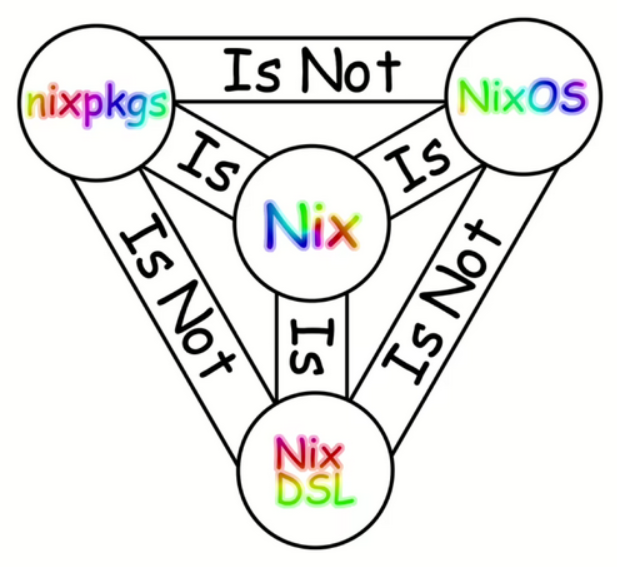
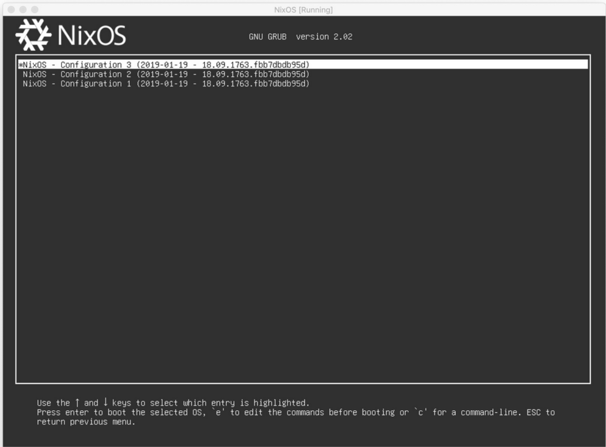

# Nix: Reproducible Builds and Environments #

## Say Goodbye to "But It Works on My Machine!" ##

---

<!-- markdown-toc start - Don't edit this section. Run M-x markdown-toc-refresh-toc -->
**Table of Contents**

- [Getting this out of the way...](#getting-this-out-of-the-way)
- [**Isolation**](#isolation)
- [**Flexibility and Scalability**](#flexibility-and-scalability)
- [**Integration with Docker**](#integration-with-docker)
- [**Community and Ecosystem**](#community-and-ecosystem)
- [**Practical Examples**](#practical-examples)
- [references](#references)

<!-- markdown-toc end -->


---

## Getting this out of the way... ##

**Nix is weird**
<p align="center">
  
</p>


---
### **Reproducibility** ###

**Immutable and Declarative Configuration** <!-- .element: class="fragment" -->

<!-- Note: Nix allows for defining the entire system environment in a declarative manner, ensuring that any system built from the same configuration is identical. This immutability ensures that dependencies and configurations do not change unexpectedly, which is crucial for reproducible builds. -->

**Environment Pinning and Locking** <!-- .element: class="fragment" -->

<!-- Note: With features like `flake.nix` and `flake.lock`, Nix can pin specific versions of packages and dependencies, ensuring consistent environments across different machines and timeframes. -->

---

**Rollback In Case Of Failure**

<p align="center">
    
</p>


---

## **Isolation** ##

**Dependency Management** <!-- .element: class="fragment" -->

<!-- Nix's approach to managing dependencies ensures that they are isolated from the global system environment, preventing conflicts and ensuring clean, repeatable builds. Each package build is isolated, which means different projects can use different versions of the same dependency without interference【10†source】. -->

**Sandboxed Builds** <!-- .element: class="fragment" -->

<!-- Builds in Nix are sandboxed, providing a controlled environment that avoids contamination from the host system and other builds. -->

---

## **Flexibility and Scalability** ##

**Cross-Platform Capabilities** <!-- .element: class="fragment" -->

<!-- Nix works across various operating systems, making it a versatile tool for development teams working in heterogeneous environments. This cross-platform nature simplifies managing and synchronizing development environments across different OSs -->

**Nix Flakes for Modern Package Management** <!-- .element: class="fragment" -->

<!-- Flakes improve the composability and manageability of configurations. They enable easier sharing and versioning of Nix projects, which is particularly useful for larger teams and more complex setups. -->

---

## **Integration with Docker** ##

**Reproducible Docker Images** <!-- .element: class="fragment" -->

<!-- Nix can be used to define and build Docker images in a reproducible manner. This ensures that Docker images built from Nix definitions are consistent, which is important for deploying reliable applications -->

**Layer Optimization** <!-- .element: class="fragment" -->

<!-- By leveraging Nix, you can optimize the layers in Docker images, potentially reducing image sizes and improving build efficiency. -->

---

## **Community and Ecosystem** ##

**Rich Package Repository (100.000+)** <!-- .element: class="fragment" -->


<!-- The Nixpkgs repository contains a vast array of pre-built packages, facilitating quick setup and reducing the need to build packages from scratch【9†source】【10†source】. -->

**Active and Supportive Community** <!-- .element: class="fragment" -->


<!-- : The Nix community is active and continually improving the ecosystem, providing resources, documentation, and support that can be invaluable for new and experienced users alike. -->

---

## **Practical Examples** ##

**Home Manager** <!-- .element: class="fragment" -->

<!-- Demonstrate how Nix can manage user-specific configurations and packages, making it easy to replicate a user's environment across multiple machines -->

**This environment** <!-- .element: class="fragment" -->

```nix [-|3|4-7|9|11-14|15-18|21-31]
# ./flake.nix
{
  description = "Simple tex-env with pre-commit";

  inputs = { 
    nixpkgs.url = "github:NixOS/nixpkgs/nixos-unstable"; 
  };

  outputs = { self, nixpkgs }:
    let
      forAllSystems = function:
        nixpkgs.lib.genAttrs [ "x86_64-linux" ]
          (system: function nixpkgs.legacyPackages.${system});

      generalPackages = pkgs: with pkgs; [
        reveal-md
        marksman
      ];

    in 
    {
      devShells = forAllSystems (pkgs: {
        default = pkgs.mkShell {
          packages = (generalPackages pkgs);

          shellHook = ''
          echo "Welcome to the ❄️nix❄️ shell!"
          '';
        };
      });
    };
}

```

---

## references ##

- The documentation: https://nixos.org/
- learn nix, nixos, and flakes in an well written online book here: https://nixos-and-flakes.thiscute.world/

